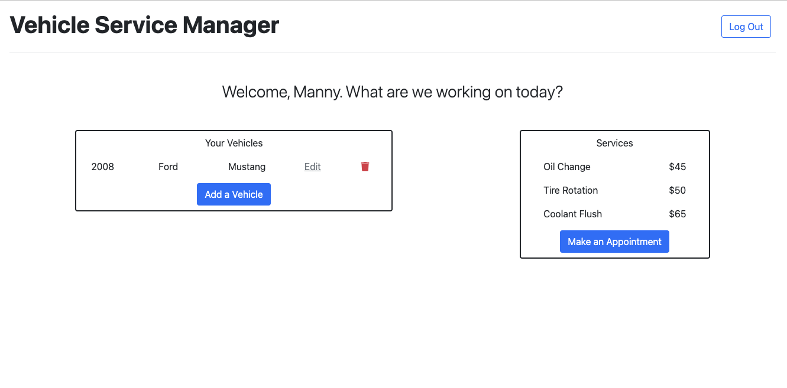

# Vehicle Service Manager

## Description

A vehicle maintenance request site where customers can login and request three different services, oil change; coolant flush; and tire rotation.

We built this project to streamline the scheduling of maintenance requests for customers.

## Table of Contents

- [Usage](#usage)
- [Credits](#credits)
- [How to Contribute](#how-to-contribute)

## Usage

## Credits

Manny Garcia gitHub: mannygarcia98

Mitchell Frey gitHub: mfcodingbc

Jermaine Walters gitHub: walte1jj

## How to Contribute

[] Flash alerts for login/logout operations
